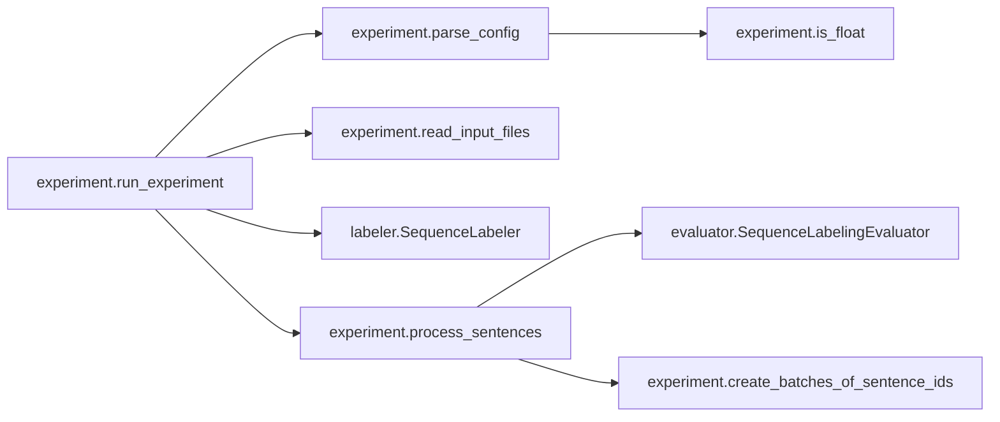
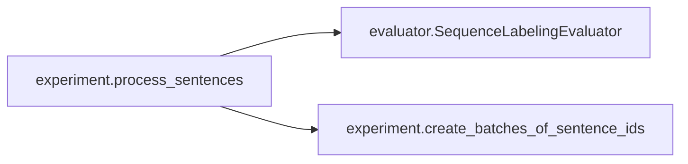
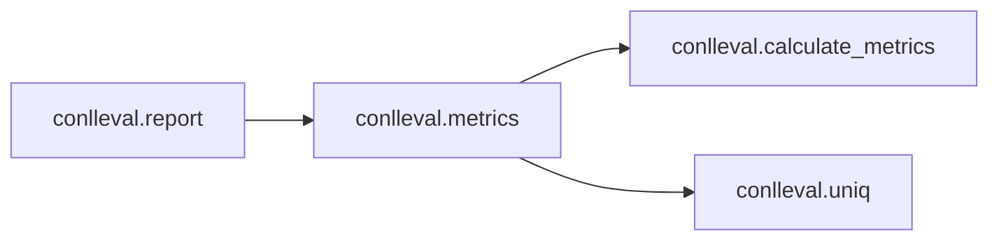
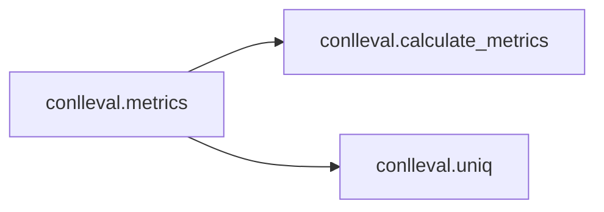
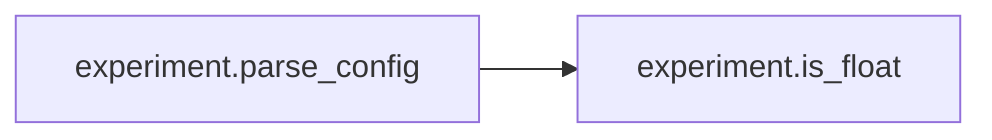
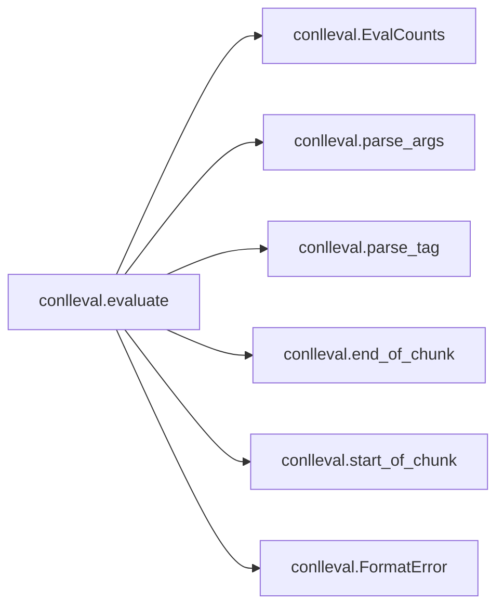
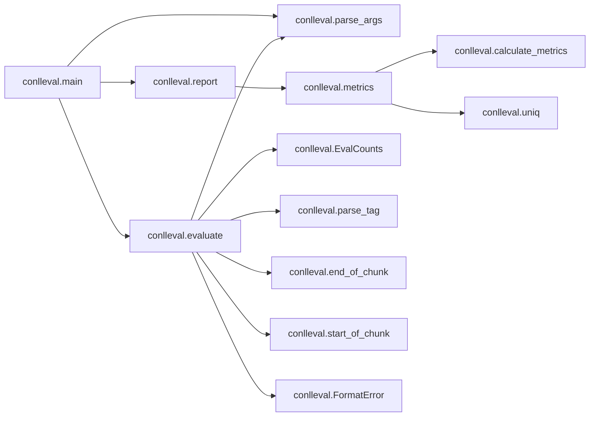

# Key Objects

[_Documentation generated by Documatic_](https://www.documatic.com)

<!---Documatic-section-experiment.run_experiment-start--->
## experiment.run_experiment

<!---Documatic-section-run_experiment-start--->


### Object Calls

* experiment.parse_config
* experiment.read_input_files
* labeler.SequenceLabeler
* experiment.process_sentences

<!---Documatic-block-experiment.run_experiment-start--->
<details>
	<summary><code>experiment.run_experiment</code> code snippet</summary>

```python
def run_experiment(config_path):
    config = parse_config('config', config_path)
    temp_model_path = config_path + '.model'
    if 'random_seed' in config:
        random.seed(config['random_seed'])
        numpy.random.seed(config['random_seed'])
    for (key, val) in config.items():
        print(str(key) + ': ' + str(val))
    (data_train, data_dev, data_test) = (None, None, None)
    if config['path_train'] != None and len(config['path_train']) > 0:
        data_train = read_input_files(config['path_train'], config['max_train_sent_length'])
    if config['path_dev'] != None and len(config['path_dev']) > 0:
        data_dev = read_input_files(config['path_dev'])
    if config['path_test'] != None and len(config['path_test']) > 0:
        data_test = []
        for path_test in config['path_test'].strip().split(':'):
            data_test += read_input_files(path_test)
    if config['load'] != None and len(config['load']) > 0:
        labeler = SequenceLabeler.load(config['load'])
    else:
        labeler = SequenceLabeler(config)
        labeler.build_vocabs(data_train, data_dev, data_test, config['preload_vectors'])
        labeler.construct_network()
        labeler.initialize_session()
        if config['preload_vectors'] != None:
            labeler.preload_word_embeddings(config['preload_vectors'])
    print('parameter_count: ' + str(labeler.get_parameter_count()))
    print('parameter_count_without_word_embeddings: ' + str(labeler.get_parameter_count_without_word_embeddings()))
    if data_train != None:
        model_selector = config['model_selector'].split(':')[0]
        model_selector_type = config['model_selector'].split(':')[1]
        best_selector_value = 0.0
        best_epoch = -1
        learningrate = config['learningrate']
        for epoch in range(config['epochs']):
            print('EPOCH: ' + str(epoch))
            print('current_learningrate: ' + str(learningrate))
            random.shuffle(data_train)
            results_train = process_sentences(data_train, labeler, is_training=True, learningrate=learningrate, config=config, name='train')
            if data_dev != None:
                results_dev = process_sentences(data_dev, labeler, is_training=False, learningrate=0.0, config=config, name='dev')
                if math.isnan(results_dev['dev_cost_sum']) or math.isinf(results_dev['dev_cost_sum']):
                    sys.stderr.write('ERROR: Cost is NaN or Inf. Exiting.\n')
                    break
                if epoch == 0 or (model_selector_type == 'high' and results_dev[model_selector] > best_selector_value) or (model_selector_type == 'low' and results_dev[model_selector] < best_selector_value):
                    best_epoch = epoch
                    best_selector_value = results_dev[model_selector]
                    labeler.saver.save(labeler.session, temp_model_path, latest_filename=os.path.basename(temp_model_path) + '.checkpoint')
                print('best_epoch: ' + str(best_epoch))
                if config['stop_if_no_improvement_for_epochs'] > 0 and epoch - best_epoch >= config['stop_if_no_improvement_for_epochs']:
                    break
                if epoch - best_epoch > 3:
                    learningrate *= config['learningrate_decay']
            while config['garbage_collection'] == True and gc.collect() > 0:
                pass
        if data_dev != None and best_epoch >= 0:
            labeler.saver.restore(labeler.session, temp_model_path)
            os.remove(temp_model_path + '.checkpoint')
            os.remove(temp_model_path + '.data-00000-of-00001')
            os.remove(temp_model_path + '.index')
            os.remove(temp_model_path + '.meta')
    if config['save'] is not None and len(config['save']) > 0:
        labeler.save(config['save'])
    if config['path_test'] is not None:
        i = 0
        for path_test in config['path_test'].strip().split(':'):
            data_test = read_input_files(path_test)
            results_test = process_sentences(data_test, labeler, is_training=False, learningrate=0.0, config=config, name='test' + str(i))
            i += 1
```
</details>
<!---Documatic-block-experiment.run_experiment-end--->
<!---Documatic-section-run_experiment-end--->

# #
<!---Documatic-section-experiment.run_experiment-end--->

<!---Documatic-section-experiment.process_sentences-start--->
## experiment.process_sentences

<!---Documatic-section-process_sentences-start--->


### Object Calls

* evaluator.SequenceLabelingEvaluator
* experiment.create_batches_of_sentence_ids

<!---Documatic-block-experiment.process_sentences-start--->
<details>
	<summary><code>experiment.process_sentences</code> code snippet</summary>

```python
def process_sentences(data, labeler, is_training, learningrate, config, name):
    evaluator = SequenceLabelingEvaluator(config['main_label'], labeler.label2id, config['conll_eval'])
    batches_of_sentence_ids = create_batches_of_sentence_ids(data, config['batch_equal_size'], config['max_batch_size'])
    if is_training == True:
        random.shuffle(batches_of_sentence_ids)
    for sentence_ids_in_batch in batches_of_sentence_ids:
        batch = [data[i] for i in sentence_ids_in_batch]
        (cost, predicted_labels, predicted_probs) = labeler.process_batch(batch, is_training, learningrate)
        evaluator.append_data(cost, batch, predicted_labels)
        (word_ids, char_ids, char_mask, label_ids) = (None, None, None, None)
        while config['garbage_collection'] == True and gc.collect() > 0:
            pass
    results = evaluator.get_results(name)
    for key in results:
        print(key + ': ' + str(results[key]))
    return results
```
</details>
<!---Documatic-block-experiment.process_sentences-end--->
<!---Documatic-section-process_sentences-end--->

# #
<!---Documatic-section-experiment.process_sentences-end--->

<!---Documatic-section-print_output.print_predictions-start--->
## print_output.print_predictions

<!---Documatic-section-print_predictions-start--->
<!---Documatic-block-print_output.print_predictions-start--->
<details>
	<summary><code>print_output.print_predictions</code> code snippet</summary>

```python
def print_predictions(print_probs, model_path, input_file):
    time_loading = time.time()
    model = labeler.SequenceLabeler.load(model_path)
    time_noloading = time.time()
    config = model.config
    predictions_cache = {}
    id2label = collections.OrderedDict()
    for label in model.label2id:
        id2label[model.label2id[label]] = label
    sentences_test = experiment.read_input_files(input_file)
    batches_of_sentence_ids = experiment.create_batches_of_sentence_ids(sentences_test, config['batch_equal_size'], config['max_batch_size'])
    for sentence_ids_in_batch in batches_of_sentence_ids:
        batch = [sentences_test[i] for i in sentence_ids_in_batch]
        (cost, predicted_labels, predicted_probs) = model.process_batch(batch, is_training=False, learningrate=0.0)
        assert len(sentence_ids_in_batch) == len(predicted_labels)
        for i in range(len(sentence_ids_in_batch)):
            key = str(sentence_ids_in_batch[i])
            predictions = []
            if print_probs == False:
                for j in range(len(predicted_labels[i])):
                    predictions.append(id2label[predicted_labels[i][j]])
            elif print_probs == True:
                for j in range(len(predicted_probs[i])):
                    p_ = ''
                    for k in range(len(predicted_probs[i][j])):
                        p_ += str(id2label[k]) + ':' + str(predicted_probs[i][j][k]) + '\t'
                    predictions.append(p_.strip())
            predictions_cache[key] = predictions
    sentence_id = 0
    word_id = 0
    with open(input_file, 'r') as f:
        for line in f:
            if len(line.strip()) == 0:
                print('')
                if word_id == 0:
                    continue
                assert len(predictions_cache[str(sentence_id)]) == word_id, str(len(predictions_cache[str(sentence_id)])) + ' ' + str(word_id)
                sentence_id += 1
                word_id = 0
                continue
            assert str(sentence_id) in predictions_cache
            assert len(predictions_cache[str(sentence_id)]) > word_id
            print(line.strip() + '\t' + predictions_cache[str(sentence_id)][word_id].strip())
            word_id += 1
    sys.stderr.write('Processed: ' + input_file + '\n')
    sys.stderr.write('Elapsed time with loading: ' + str(time.time() - time_loading) + '\n')
    sys.stderr.write('Elapsed time without loading: ' + str(time.time() - time_noloading) + '\n')
```
</details>
<!---Documatic-block-print_output.print_predictions-end--->
<!---Documatic-section-print_predictions-end--->

# #
<!---Documatic-section-print_output.print_predictions-end--->

<!---Documatic-section-conlleval.report-start--->
## conlleval.report

<!---Documatic-section-report-start--->


### Object Calls

* conlleval.metrics

<!---Documatic-block-conlleval.report-start--->
<details>
	<summary><code>conlleval.report</code> code snippet</summary>

```python
def report(counts, out=None):
    if out is None:
        out = sys.stdout
    (overall, by_type) = metrics(counts)
    c = counts
    out.write('processed %d tokens with %d phrases; ' % (c.token_counter, c.found_correct))
    out.write('found: %d phrases; correct: %d.\n' % (c.found_guessed, c.correct_chunk))
    if c.token_counter > 0:
        out.write('accuracy: %6.2f%%; ' % (100.0 * c.correct_tags / c.token_counter))
        out.write('precision: %6.2f%%; ' % (100.0 * overall.prec))
        out.write('recall: %6.2f%%; ' % (100.0 * overall.rec))
        out.write('FB1: %6.2f\n' % (100.0 * overall.fscore))
    for (i, m) in sorted(by_type.items()):
        out.write('%17s: ' % i)
        out.write('precision: %6.2f%%; ' % (100.0 * m.prec))
        out.write('recall: %6.2f%%; ' % (100.0 * m.rec))
        out.write('FB1: %6.2f  %d\n' % (100.0 * m.fscore, c.t_found_guessed[i]))
```
</details>
<!---Documatic-block-conlleval.report-end--->
<!---Documatic-section-report-end--->

# #
<!---Documatic-section-conlleval.report-end--->

<!---Documatic-section-conlleval.calculate_metrics-start--->
## conlleval.calculate_metrics

<!---Documatic-section-calculate_metrics-start--->
<!---Documatic-block-conlleval.calculate_metrics-start--->
<details>
	<summary><code>conlleval.calculate_metrics</code> code snippet</summary>

```python
def calculate_metrics(correct, guessed, total):
    (tp, fp, fn) = (correct, guessed - correct, total - correct)
    p = 0 if tp + fp == 0 else 1.0 * tp / (tp + fp)
    r = 0 if tp + fn == 0 else 1.0 * tp / (tp + fn)
    f = 0 if p + r == 0 else 2 * p * r / (p + r)
    return Metrics(tp, fp, fn, p, r, f)
```
</details>
<!---Documatic-block-conlleval.calculate_metrics-end--->
<!---Documatic-section-calculate_metrics-end--->

# #
<!---Documatic-section-conlleval.calculate_metrics-end--->

<!---Documatic-section-conlleval.parse_tag-start--->
## conlleval.parse_tag

<!---Documatic-section-parse_tag-start--->
<!---Documatic-block-conlleval.parse_tag-start--->
<details>
	<summary><code>conlleval.parse_tag</code> code snippet</summary>

```python
def parse_tag(t):
    m = re.match('^([^-]*)-(.*)$', t)
    return m.groups() if m else (t, '')
```
</details>
<!---Documatic-block-conlleval.parse_tag-end--->
<!---Documatic-section-parse_tag-end--->

# #
<!---Documatic-section-conlleval.parse_tag-end--->

<!---Documatic-section-experiment.read_input_files-start--->
## experiment.read_input_files

<!---Documatic-section-read_input_files-start--->
<!---Documatic-block-experiment.read_input_files-start--->
<details>
	<summary><code>experiment.read_input_files</code> code snippet</summary>

```python
def read_input_files(file_paths, max_sentence_length=-1):
    sentences = []
    line_length = None
    for file_path in file_paths.strip().split(','):
        with open(file_path, 'r') as f:
            sentence = []
            for line in f:
                line = line.strip()
                if len(line) > 0:
                    line_parts = line.split()
                    assert len(line_parts) >= 2
                    assert len(line_parts) == line_length or line_length == None
                    line_length = len(line_parts)
                    sentence.append(line_parts)
                elif len(line) == 0 and len(sentence) > 0:
                    if max_sentence_length <= 0 or len(sentence) <= max_sentence_length:
                        sentences.append(sentence)
                    sentence = []
            if len(sentence) > 0:
                if max_sentence_length <= 0 or len(sentence) <= max_sentence_length:
                    sentences.append(sentence)
    return sentences
```
</details>
<!---Documatic-block-experiment.read_input_files-end--->
<!---Documatic-section-read_input_files-end--->

# #
<!---Documatic-section-experiment.read_input_files-end--->

<!---Documatic-section-conlleval.parse_args-start--->
## conlleval.parse_args

<!---Documatic-section-parse_args-start--->
<!---Documatic-block-conlleval.parse_args-start--->
<details>
	<summary><code>conlleval.parse_args</code> code snippet</summary>

```python
def parse_args(argv):
    import argparse
    parser = argparse.ArgumentParser(description='evaluate tagging results using CoNLL criteria', formatter_class=argparse.ArgumentDefaultsHelpFormatter)
    arg = parser.add_argument
    arg('-b', '--boundary', metavar='STR', default='-X-', help='sentence boundary')
    arg('-d', '--delimiter', metavar='CHAR', default=ANY_SPACE, help='character delimiting items in input')
    arg('-o', '--otag', metavar='CHAR', default='O', help='alternative outside tag')
    arg('file', nargs='?', default=None)
    return parser.parse_args(argv)
```
</details>
<!---Documatic-block-conlleval.parse_args-end--->
<!---Documatic-section-parse_args-end--->

# #
<!---Documatic-section-conlleval.parse_args-end--->

<!---Documatic-section-experiment.create_batches_of_sentence_ids-start--->
## experiment.create_batches_of_sentence_ids

<!---Documatic-section-create_batches_of_sentence_ids-start--->
<!---Documatic-block-experiment.create_batches_of_sentence_ids-start--->
<details>
	<summary><code>experiment.create_batches_of_sentence_ids</code> code snippet</summary>

```python
def create_batches_of_sentence_ids(sentences, batch_equal_size, max_batch_size):
    batches_of_sentence_ids = []
    if batch_equal_size == True:
        sentence_ids_by_length = collections.OrderedDict()
        sentence_length_sum = 0.0
        for i in range(len(sentences)):
            length = len(sentences[i])
            if length not in sentence_ids_by_length:
                sentence_ids_by_length[length] = []
            sentence_ids_by_length[length].append(i)
        for sentence_length in sentence_ids_by_length:
            if max_batch_size > 0:
                batch_size = max_batch_size
            else:
                batch_size = int(-1.0 * max_batch_size / sentence_length)
            for i in range(0, len(sentence_ids_by_length[sentence_length]), batch_size):
                batches_of_sentence_ids.append(sentence_ids_by_length[sentence_length][i:i + batch_size])
    else:
        current_batch = []
        max_sentence_length = 0
        for i in range(len(sentences)):
            current_batch.append(i)
            if len(sentences[i]) > max_sentence_length:
                max_sentence_length = len(sentences[i])
            if max_batch_size > 0 and len(current_batch) >= max_batch_size or (max_batch_size <= 0 and len(current_batch) * max_sentence_length >= -1 * max_batch_size):
                batches_of_sentence_ids.append(current_batch)
                current_batch = []
                max_sentence_length = 0
        if len(current_batch) > 0:
            batches_of_sentence_ids.append(current_batch)
    return batches_of_sentence_ids
```
</details>
<!---Documatic-block-experiment.create_batches_of_sentence_ids-end--->
<!---Documatic-section-create_batches_of_sentence_ids-end--->

# #
<!---Documatic-section-experiment.create_batches_of_sentence_ids-end--->

<!---Documatic-section-conlleval.start_of_chunk-start--->
## conlleval.start_of_chunk

<!---Documatic-section-start_of_chunk-start--->
<!---Documatic-block-conlleval.start_of_chunk-start--->
<details>
	<summary><code>conlleval.start_of_chunk</code> code snippet</summary>

```python
def start_of_chunk(prev_tag, tag, prev_type, type_):
    chunk_start = False
    if tag == 'B':
        chunk_start = True
    if tag == 'S':
        chunk_start = True
    if prev_tag == 'E' and tag == 'E':
        chunk_start = True
    if prev_tag == 'E' and tag == 'I':
        chunk_start = True
    if prev_tag == 'S' and tag == 'E':
        chunk_start = True
    if prev_tag == 'S' and tag == 'I':
        chunk_start = True
    if prev_tag == 'O' and tag == 'E':
        chunk_start = True
    if prev_tag == 'O' and tag == 'I':
        chunk_start = True
    if tag != 'O' and tag != '.' and (prev_type != type_):
        chunk_start = True
    if tag == '[':
        chunk_start = True
    if tag == ']':
        chunk_start = True
    return chunk_start
```
</details>
<!---Documatic-block-conlleval.start_of_chunk-end--->
<!---Documatic-section-start_of_chunk-end--->

# #
<!---Documatic-section-conlleval.start_of_chunk-end--->

<!---Documatic-section-experiment.is_float-start--->
## experiment.is_float

<!---Documatic-section-is_float-start--->
<!---Documatic-block-experiment.is_float-start--->
<details>
	<summary><code>experiment.is_float</code> code snippet</summary>

```python
def is_float(value):
    try:
        float(value)
        return True
    except ValueError:
        return False
```
</details>
<!---Documatic-block-experiment.is_float-end--->
<!---Documatic-section-is_float-end--->

# #
<!---Documatic-section-experiment.is_float-end--->

<!---Documatic-section-conlleval.metrics-start--->
## conlleval.metrics

<!---Documatic-section-metrics-start--->


### Object Calls

* conlleval.calculate_metrics
* conlleval.uniq

<!---Documatic-block-conlleval.metrics-start--->
<details>
	<summary><code>conlleval.metrics</code> code snippet</summary>

```python
def metrics(counts):
    c = counts
    overall = calculate_metrics(c.correct_chunk, c.found_guessed, c.found_correct)
    by_type = {}
    for t in uniq(list(c.t_found_correct.keys()) + list(c.t_found_guessed.keys())):
        by_type[t] = calculate_metrics(c.t_correct_chunk[t], c.t_found_guessed[t], c.t_found_correct[t])
    return (overall, by_type)
```
</details>
<!---Documatic-block-conlleval.metrics-end--->
<!---Documatic-section-metrics-end--->

# #
<!---Documatic-section-conlleval.metrics-end--->

<!---Documatic-section-experiment.parse_config-start--->
## experiment.parse_config

<!---Documatic-section-parse_config-start--->


### Object Calls

* experiment.is_float

<!---Documatic-block-experiment.parse_config-start--->
<details>
	<summary><code>experiment.parse_config</code> code snippet</summary>

```python
def parse_config(config_section, config_path):
    config_parser = configparser.SafeConfigParser(allow_no_value=True)
    config_parser.read(config_path)
    config = collections.OrderedDict()
    for (key, value) in config_parser.items(config_section):
        if value is None or len(value.strip()) == 0:
            config[key] = None
        elif value.lower() in ['true', 'false']:
            config[key] = config_parser.getboolean(config_section, key)
        elif value.isdigit():
            config[key] = config_parser.getint(config_section, key)
        elif is_float(value):
            config[key] = config_parser.getfloat(config_section, key)
        else:
            config[key] = config_parser.get(config_section, key)
    return config
```
</details>
<!---Documatic-block-experiment.parse_config-end--->
<!---Documatic-section-parse_config-end--->

# #
<!---Documatic-section-experiment.parse_config-end--->

<!---Documatic-section-conlleval.evaluate-start--->
## conlleval.evaluate

<!---Documatic-section-evaluate-start--->


### Object Calls

* conlleval.EvalCounts
* conlleval.parse_args
* conlleval.parse_tag
* conlleval.end_of_chunk
* conlleval.start_of_chunk
* conlleval.FormatError

<!---Documatic-block-conlleval.evaluate-start--->
<details>
	<summary><code>conlleval.evaluate</code> code snippet</summary>

```python
def evaluate(iterable, options=None):
    if options is None:
        options = parse_args([])
    counts = EvalCounts()
    num_features = None
    in_correct = False
    last_correct = 'O'
    last_correct_type = ''
    last_guessed = 'O'
    last_guessed_type = ''
    for line in iterable:
        line = line.rstrip('\r\n')
        if options.delimiter == ANY_SPACE:
            features = line.split()
        else:
            features = line.split(options.delimiter)
        if num_features is None:
            num_features = len(features)
        elif num_features != len(features) and len(features) != 0:
            raise FormatError('unexpected number of features: %d (%d)' % (len(features), num_features))
        if len(features) == 0 or features[0] == options.boundary:
            features = [options.boundary, 'O', 'O']
        if len(features) < 3:
            raise FormatError('unexpected number of features in line %s' % line)
        (guessed, guessed_type) = parse_tag(features.pop())
        (correct, correct_type) = parse_tag(features.pop())
        first_item = features.pop(0)
        if first_item == options.boundary:
            guessed = 'O'
        end_correct = end_of_chunk(last_correct, correct, last_correct_type, correct_type)
        end_guessed = end_of_chunk(last_guessed, guessed, last_guessed_type, guessed_type)
        start_correct = start_of_chunk(last_correct, correct, last_correct_type, correct_type)
        start_guessed = start_of_chunk(last_guessed, guessed, last_guessed_type, guessed_type)
        if in_correct:
            if end_correct and end_guessed and (last_guessed_type == last_correct_type):
                in_correct = False
                counts.correct_chunk += 1
                counts.t_correct_chunk[last_correct_type] += 1
            elif end_correct != end_guessed or guessed_type != correct_type:
                in_correct = False
        if start_correct and start_guessed and (guessed_type == correct_type):
            in_correct = True
        if start_correct:
            counts.found_correct += 1
            counts.t_found_correct[correct_type] += 1
        if start_guessed:
            counts.found_guessed += 1
            counts.t_found_guessed[guessed_type] += 1
        if first_item != options.boundary:
            if correct == guessed and guessed_type == correct_type:
                counts.correct_tags += 1
            counts.token_counter += 1
        last_guessed = guessed
        last_correct = correct
        last_guessed_type = guessed_type
        last_correct_type = correct_type
    if in_correct:
        counts.correct_chunk += 1
        counts.t_correct_chunk[last_correct_type] += 1
    return counts
```
</details>
<!---Documatic-block-conlleval.evaluate-end--->
<!---Documatic-section-evaluate-end--->

# #
<!---Documatic-section-conlleval.evaluate-end--->

<!---Documatic-section-conlleval.main-start--->
## conlleval.main

<!---Documatic-section-main-start--->


### Object Calls

* conlleval.parse_args
* conlleval.report
* conlleval.evaluate

<!---Documatic-block-conlleval.main-start--->
<details>
	<summary><code>conlleval.main</code> code snippet</summary>

```python
def main(argv):
    args = parse_args(argv[1:])
    if args.file is None:
        counts = evaluate(sys.stdin, args)
    else:
        with open(args.file) as f:
            counts = evaluate(f, args)
    report(counts)
```
</details>
<!---Documatic-block-conlleval.main-end--->
<!---Documatic-section-main-end--->

# #
<!---Documatic-section-conlleval.main-end--->

<!---Documatic-section-conlleval.uniq-start--->
## conlleval.uniq

<!---Documatic-section-uniq-start--->
<!---Documatic-block-conlleval.uniq-start--->
<details>
	<summary><code>conlleval.uniq</code> code snippet</summary>

```python
def uniq(iterable):
    seen = set()
    return [i for i in iterable if not (i in seen or seen.add(i))]
```
</details>
<!---Documatic-block-conlleval.uniq-end--->
<!---Documatic-section-uniq-end--->

# #
<!---Documatic-section-conlleval.uniq-end--->

<!---Documatic-section-conlleval.end_of_chunk-start--->
## conlleval.end_of_chunk

<!---Documatic-section-end_of_chunk-start--->
<!---Documatic-block-conlleval.end_of_chunk-start--->
<details>
	<summary><code>conlleval.end_of_chunk</code> code snippet</summary>

```python
def end_of_chunk(prev_tag, tag, prev_type, type_):
    chunk_end = False
    if prev_tag == 'E':
        chunk_end = True
    if prev_tag == 'S':
        chunk_end = True
    if prev_tag == 'B' and tag == 'B':
        chunk_end = True
    if prev_tag == 'B' and tag == 'S':
        chunk_end = True
    if prev_tag == 'B' and tag == 'O':
        chunk_end = True
    if prev_tag == 'I' and tag == 'B':
        chunk_end = True
    if prev_tag == 'I' and tag == 'S':
        chunk_end = True
    if prev_tag == 'I' and tag == 'O':
        chunk_end = True
    if prev_tag != 'O' and prev_tag != '.' and (prev_type != type_):
        chunk_end = True
    if prev_tag == ']':
        chunk_end = True
    if prev_tag == '[':
        chunk_end = True
    return chunk_end
```
</details>
<!---Documatic-block-conlleval.end_of_chunk-end--->
<!---Documatic-section-end_of_chunk-end--->

# #
<!---Documatic-section-conlleval.end_of_chunk-end--->

[_Documentation generated by Documatic_](https://www.documatic.com)